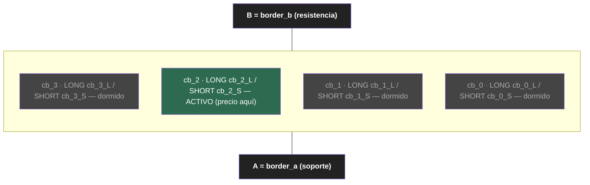
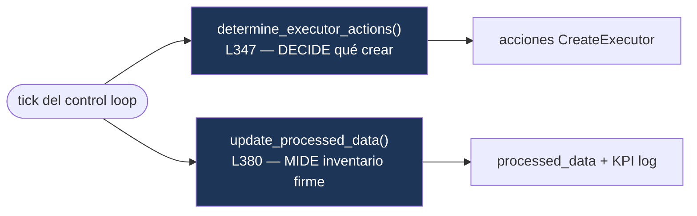
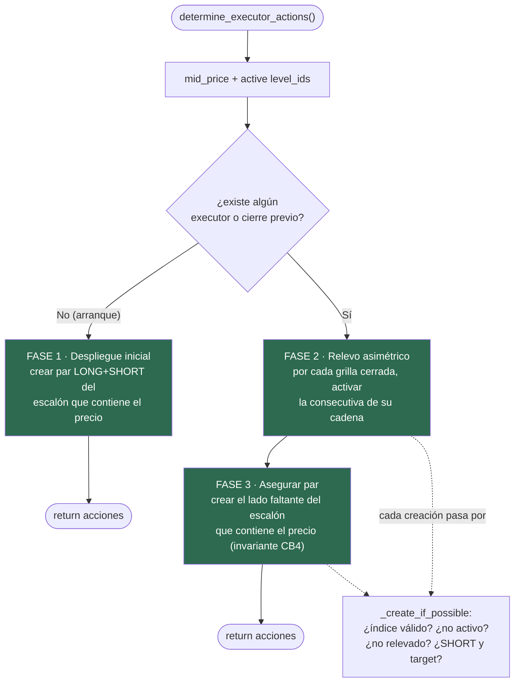
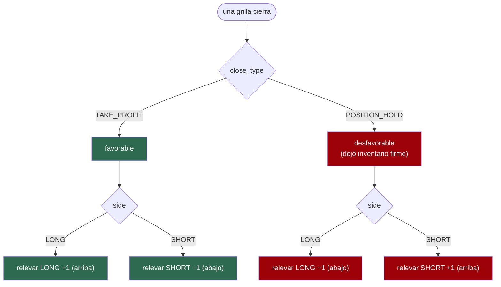
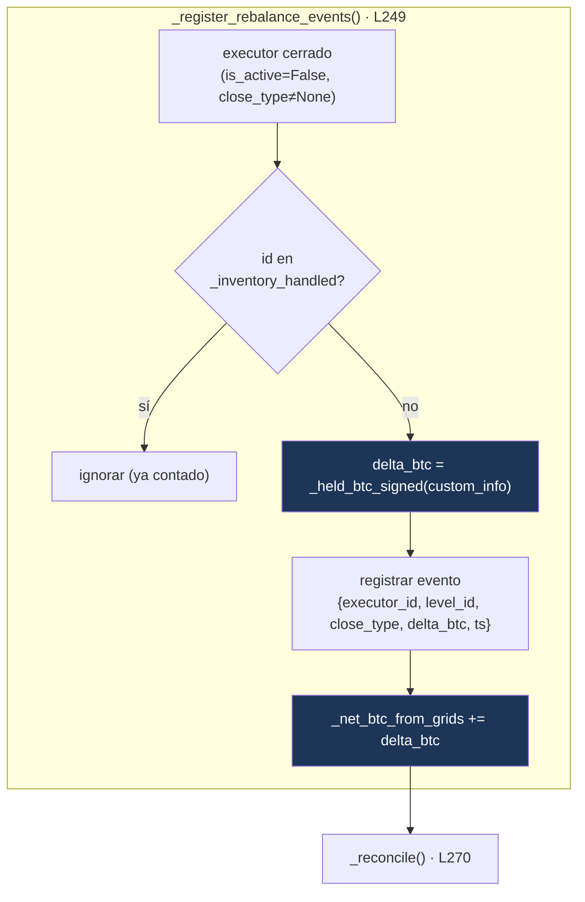
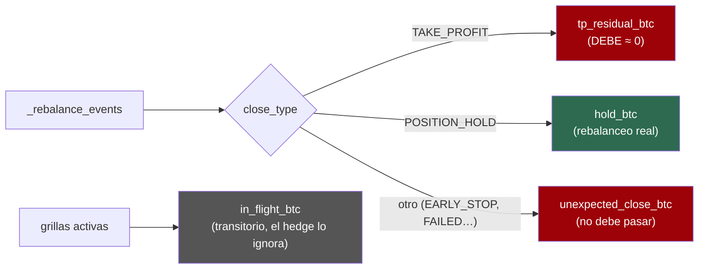
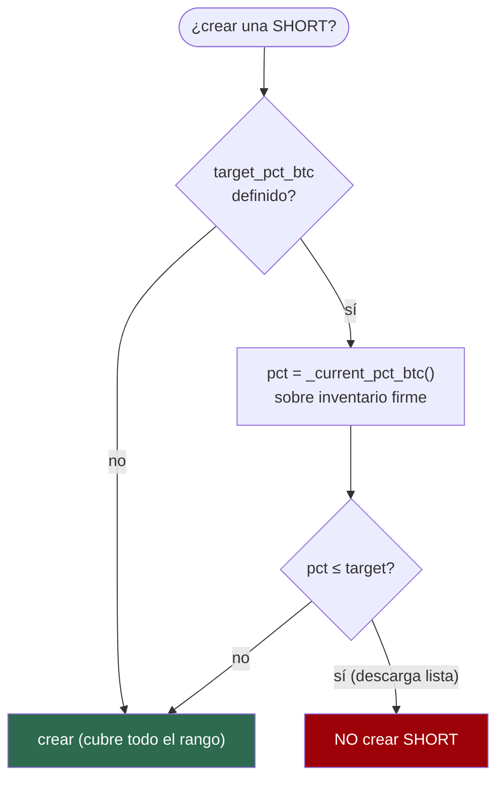
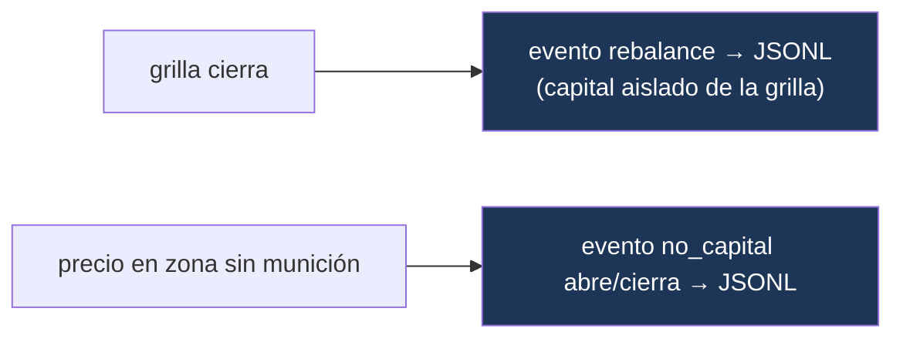

# Controller `chessboard` — Lógica pura

> **Qué es este documento:** la especificación auditable y comunicable de la
> lógica del controller. No es el código: es el *modelo de comportamiento* que el
> código implementa, con diagramas para revisarlo de un vistazo. Si el código y
> este doc divergen, uno de los dos está mal — y hay que arreglarlo.
>
> **Archivo:** `controllers/generic/chessboard.py`
> **Tests:** `test/hummingbot/strategy_v2/controllers/test_chessboard.py` (26)
> **Última actualización:** 2026-06-02

---

## 1. Qué hace el controller en una frase

Orquesta un **tablero de grillas**: divide el rango `[A, B]` en `N` escalones
contiguos, opera el par LONG+SHORT del escalón donde está el precio, **releva** la
grilla consecutiva cuando una cierra (según *por qué* cerró), **corta** la descarga
al llegar al target de %BTC, y **mide el inventario firme con signo** que cada
cierre deja — la señal que el hedge perpetual va a seguir.

El controller **no coloca órdenes**. Crea y destruye `GridExecutor`s; cada executor
maneja sus propias órdenes. El controller es el director de orquesta, no el músico.

---

## 2. Anatomía del tablero



- **Escalón** (`_build_steps`, L131): sub-rango `[low, high]` de ancho `(B−A)/N`.
- **Slot**: cada escalón tiene DOS, identificados por `level_id` `cb_{i}_L` (LONG) y
  `cb_{i}_S` (SHORT) (`_level_id`, L141).
- **Capital por grilla** = `min(total/N/2, balance LIBRE del lado)` — el nominal
  capado al balance real disponible (`_capital_for`). LONG mira quote (BRL) libre,
  SHORT mira base (BTC) libre. Si el libre < `min_order_amount_quote`, NO se crea la
  grilla: se marca **zona sin munición** (`⊘`). Evita INSUFFICIENT_BALANCE y refleja
  el límite natural de la campaña (un lado se agota).
- **limit_price** de cada slot = borde de su banda ± `limit_distance_pct` — la zona
  muerta / centro de masa del rebalanceo (`_limit_for`, L153).

---

## 3. El control loop (cada tick)

Hummingbot llama dos métodos por tick. La separación es deliberada:



- `determine_executor_actions` (L347): **acción** — qué grillas crear (despliegue,
  relevo, corte). No mide inventario.
- `update_processed_data` (L380): **observación** — contabiliza cierres, calcula el
  inventario firme, concilia, emite el KPI log. No crea grillas.

---

## 4. `determine_executor_actions` — las tres fases



- **Fase 1 — Despliegue inicial** (L359): solo si NO hay ningún executor ni cierre
  previo. Crea el par del escalón que contiene el precio. Ocurre una vez.
- **Fase 2 — Relevo asimétrico** (L368): por cada grilla cerrada (no procesada,
  marcada en `_closed_handled` por `level_id`), activa la consecutiva en la
  dirección de `_relay_direction`.
- **Fase 3 — Asegurar el par** (L383): tras el relevo, crea el lado faltante del
  escalón que contiene el precio. El relevo propaga cada cadena por separado, así
  que en un movimiento sostenido un escalón puede quedar con un solo lado (hueco de
  cobertura). Esta fase mantiene la invariante CB4 ("siempre un par rodeando el
  precio"). **No reabre grillas ya relevadas** — la guarda `_closed_handled` lo
  impide, evitando loops de re-creación.

> **Guardas de creación** (`_create_if_possible`, L332): toda creación (Fase 1, 2 y
> 3) pasa por acá. Crea solo si el índice es válido `[0, N)`, el slot no está ya
> activo ni relevado, y —si es SHORT— el target no fue alcanzado (corte).

---

## 5. Relevo asimétrico — el corazón del modelo

La **razón** por la que una grilla cierra determina hacia dónde se releva. Esto
viene del `GridExecutor`: con `keep_position=true`, el cierre por `limit_price` es
`POSITION_HOLD` (desfavorable, dejó inventario) y el cierre por TP global es
`TAKE_PROFIT` (favorable, inventario neutro).



| Grilla | Cierre | Significado | Dirección | Próxima |
|--------|--------|-------------|-----------|---------|
| LONG  | TAKE_PROFIT   | subió, vendió arriba (neutro) | +1 | LONG arriba |
| LONG  | POSITION_HOLD | bajó al limit, **cargó BTC**   | −1 | LONG abajo  |
| SHORT | TAKE_PROFIT   | bajó, recompró abajo (neutro) | −1 | SHORT abajo |
| SHORT | POSITION_HOLD | subió al limit, **vendió BTC** | +1 | SHORT arriba |

Código: `_relay_direction` (L198). Las cadenas LONG y SHORT avanzan independientes;
nunca se pisan (testeado).

---

## 6. Inventario firme con signo — la señal del hedge

El objetivo del proyecto: NAV neutro cosechando rebates. Las grillas spot mueven
BTC; un short perpetual lo cubre. **El short se ajusta solo cuando una grilla cierra
dejando inventario firme**, no tick a tick. Por eso el controller debe reportar ese
inventario con exactitud y signo.



### 6.1 `_held_btc_signed` (L208) — de dónde sale el signo

Reconstruye el BTC firme desde `custom_info["held_position_orders"]` (lo puebla el
executor al cerrar por `POSITION_HOLD`; persiste post-cierre):

```
por cada orden held:
    + executed_amount_base   si trade_type == BUY   (LONG cargó BTC)
    − executed_amount_base   si trade_type == SELL  (SHORT vendió BTC)
```

> **Por qué no usar `held_position_value`:** esa key es una suma de quotes SIN
> signo. Sumarla en positivo contaba una venta SHORT como si fuera compra — error
> fatal para el hedge. El signo se reconstruye orden por orden.

### 6.2 La señal-setpoint

```
spot_btc_firme = base_assigned + net_btc_from_grids
```

Es el BTC real de la sub-cuenta. **El short perpetual debe igualar este número**
(fase del hedge, aún no implementada). LONG hold lo sube, SHORT hold lo baja.

---

## 7. Conciliación — la prueba de que es un reloj suizo

`_reconcile` (L270) clasifica todos los eventos y expone métricas de integridad:



- **`tp_residual_btc`** debe ser ≈ 0. Un TP que dejó held = inventario descubierto
  (el executor no liquida si el residual `< min_order_size`). Si ≠ 0, la regla
  "TP no toca el short" es insegura → bandera ⚠ en el status. **Validar en datos
  reales** (es el riesgo abierto del proyecto).
- **`hold_btc`**: el rebalanceo legítimo, lo que el short cubre.
- **`unexpected_close_btc`**: cierres fuera de {TP, HOLD}. En operación normal con
  `keep_position=true` y sin `stop_loss`, no deberían aparecer.
- **`in_flight_btc`**: BTC abierto-en-vuelo de grillas activas (con signo). NO es
  firme; el hedge lo ignora a propósito.

---

## 8. Corte en target



- Solo afecta a **SHORT** (descarga). Las **LONG** (carga) siguen siempre
  (`_create_if_possible`, L335; `_target_reached`, L320).
- `_current_pct_btc` (L302) mide sobre el inventario firme con signo de la
  **sub-cuenta** (`base_assigned + net_btc_from_grids`), aislado del balance global
  que comparten otras estrategias. Nunca el balance del connector.

---

## 9. Eventos JSONL — registro único para análisis y hedge

`_append_event` escribe `data/chessboard_events_<id>.jsonl` (un evento por línea).
Reemplaza el viejo KPI CSV. Dos tipos:

- **`rebalance`** (al cerrar una grilla): capital **aislado de la grilla** (sale del
  `custom_info` del executor, NO del connector global → sin sesgo). Campos clave:
  `capital.{assigned_quote, filled_quote, held_quote, realized_pnl_quote,
  break_even_price, delta_btc}` + `net_btc_from_grids_after`. Lo arma
  `_build_rebalance_event`.
- **`no_capital`** (estadía en zona sin munición): se **abre** cuando el precio cae
  en un escalón sin capital para abrir la grilla, se **cierra** cuando el precio sale
  o vuelve el capital. Campos: `level_id, side, asset_needed, needed_quote,
  available_quote, ts_open, ts_close, open`.



> El hedge futuro consume los eventos `rebalance` discretos (se ajusta por evento,
> no por curva continua), así que el JSONL es suficiente — no hace falta un CSV
> tick-a-tick. El `short_btc` real lo poblará la Fase 3.

La escritura va en `try/except` que nunca rompe el control loop: el KPI no es ruta
crítica.

---

## 10. Estado entre ticks (memoria del controller)

| Estructura | Tipo | Para qué | Crece/baja |
|------------|------|----------|-----------|
| `_steps` | List[dict] | escalones `{idx, low, high}` | fijo |
| `_level_executor` | Dict[str,str] | level_id → executor.id activo | se repuebla |
| `_relayed_executor_ids` | set[str] | executor.ids ya **relevados** (no relevar 2× el mismo cierre) | solo crece |
| `_closed_handled` | set[str] | level_ids relevados alguna vez — **solo para el display "·"** | solo crece |
| `_inventory_handled` | set[str] | executor.ids ya **contados** (no contar 2×) | solo crece |
| `_rebalance_events` | List[dict] | historial de cierres firmes | solo crece |
| `_net_btc_from_grids` | Decimal | BTC firme neto con signo | sube/baja |
| `_last_logged_net_btc` | Decimal? | último net logueado (KPI en cambios) | actualiza |

> **Distinción clave — todo lo recurrente se indexa por `executor.id`, no por
> `level_id`:** un slot del tablero se re-visita cuando el precio vuelve, así que
> indexar por `level_id` lo bloquearía para siempre (fue el bug de "0 grillas
> activas"). Tanto el relevo (`_relayed_executor_ids`) como el inventario
> (`_inventory_handled`) usan `executor.id` (cada cierre físico es único).
> `_closed_handled` (por level_id) sobrevive **solo como marca histórica para el
> display "·"** — no participa en ninguna decisión de creación.

---

## 11. Reglas duras que el controller NO debe contradecir

- Toda orden LIMIT_MAKER (open y TP) — `triple_barrier_config`, L82.
- `keep_position=true` obligatorio (define `POSITION_HOLD` vs liquidar a market).
- Nunca `stop_loss` en el triple_barrier (cerraría a market, rompe el modelo).
- El %BTC del corte se mide sobre la **sub-cuenta**, nunca el balance global.
- El corte en target frena solo la descarga (SHORT); la carga (LONG) sigue.

Detalle completo y trazabilidad: `docs/MANIFIESTO.md` y `docs/GRIGADO_JOURNAL.md`.
