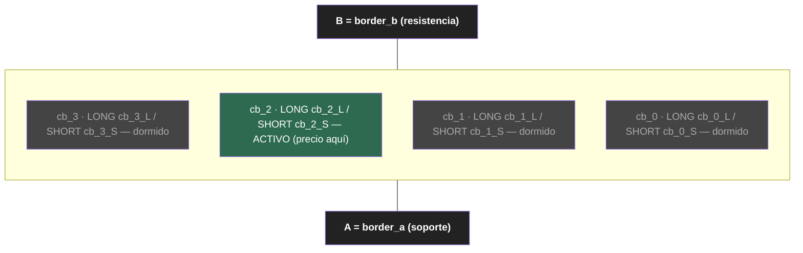
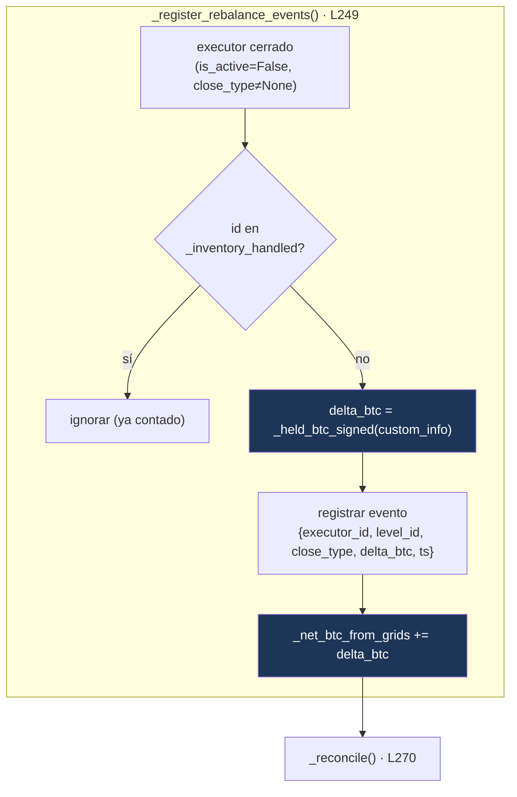
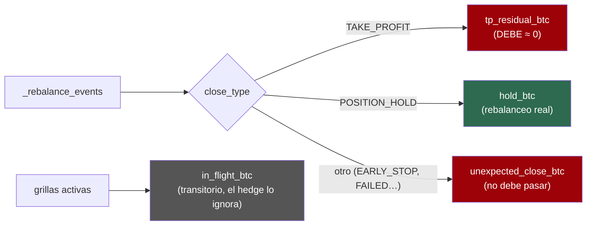
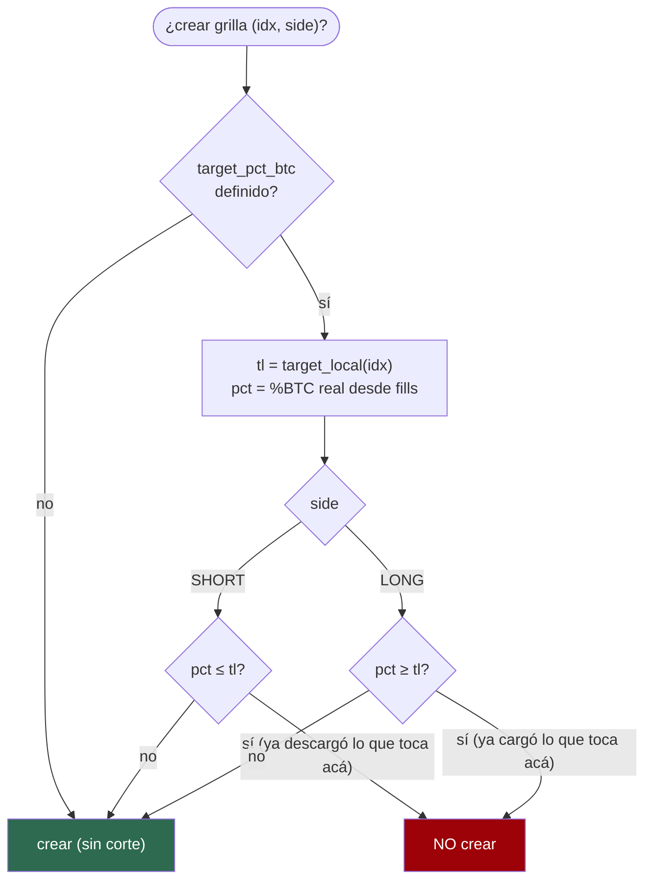
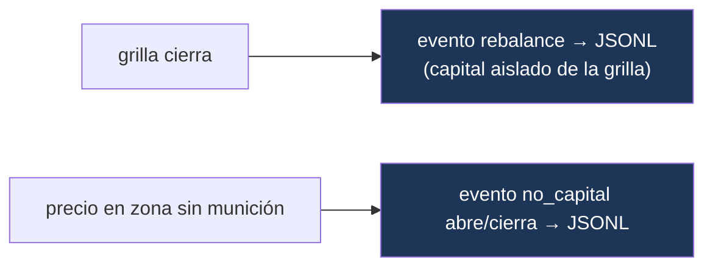

# Controller `chessboard` — Lógica pura

> **Qué es este documento:** la especificación auditable y comunicable de la
> lógica del controller. No es el código: es el *modelo de comportamiento* que el
> código implementa, con diagramas para revisarlo de un vistazo. Si el código y
> este doc divergen, uno de los dos está mal — y hay que arreglarlo.
>
> **Archivo:** `controllers/generic/chessboard.py`
> **Tests:** `test/hummingbot/strategy_v2/controllers/test_chessboard.py` (46)
> **Última actualización:** 2026-06-10

---

## 1. Qué hace el controller en una frase

Orquesta un **tablero de grillas**: divide el rango `[A, B]` en `N` escalones
contiguos, opera el par LONG+SHORT del escalón donde está el precio, **releva** la
grilla consecutiva cuando una cierra (según *por qué* cerró), **corta** la descarga
al llegar al target de %BTC, y **mide el inventario firme con signo** que cada
cierre deja — la señal que el hedge perpetual va a seguir.

El controller **no coloca órdenes**. Crea y destruye `GridExecutor`s; cada executor
maneja sus propias órdenes. El controller es el director de orquesta, no el músico.

---

## 2. Anatomía del tablero



- **Escalón** (`_build_steps`): sub-rango `[low, high]` de ancho `(B−A)/N`.
- **Slot**: cada escalón tiene DOS, identificados por `level_id` `cb_{i}_L` (LONG) y
  `cb_{i}_S` (SHORT) (`_level_id`).
- **Capital por grilla = NAV·Δtarget_local** (`_capital_for`) — **un salto por
  grilla, aterrizando en la curva determinística**. Como el NAV es invariante,
  `Δ%BTC = BRL_movido/NAV`, entonces:
  - `cap SHORT(idx) = NAV·(%BTC_actual − target_local(idx))` — vende JUSTO hasta
    el target de su escalón (sin overshoot).
  - `cap LONG(idx) = NAV·(target_local(idx) − %BTC_actual)` — compra justo hasta
    el suyo. Delta ≤ 0 → capital 0 (la creación ya está bloqueada por target local).
  - En régimen los saltos son PAREJOS: `NAV·(techo−piso)/N` por grilla; la primera
    grilla cruzada desde el ancla absorbe el gap `|%BTC_actual − su target|`.
  - Calculado EN VIVO al crear cada grilla con el inventario real desde fills
    (§6.3) → autocorrectivo: tras descargar, la siguiente solo mueve SU porción.
  - Reemplaza al reparto `descarga/n_short` (concentraba todo el recorrido en las
    grillas por encima del precio y atravesaba el target local hasta el piso).
  - Capado por balance LIBRE del lado (`_available_quote_for`). Si el libre <
    `min_order_amount_quote`, NO se crea: **zona sin munición** (`⊘`) + evento
    `no_capital`. Fallback a `total/N/2` si no hay target o inventario.
- **limit_price** de cada slot = borde de su banda ± `limit_distance_pct` — la zona
  muerta / centro de masa del rebalanceo (`_limit_for`).

---

## 3. El control loop (cada tick)

Hummingbot llama dos métodos por tick. La separación es deliberada:


- `determine_executor_actions` (L347): **acción** — qué grillas crear (despliegue,
  relevo, corte). No mide inventario.
- `update_processed_data` (L380): **observación** — contabiliza cierres, calcula el
  inventario firme, concilia, emite el KPI log. No crea grillas.

---

## 4. `determine_executor_actions` — las tres fases


- **Fase 1 — Despliegue inicial**: solo si NO hay ningún executor ni cierre
  previo. Crea el par del escalón que contiene el precio. Ocurre una vez.
- **Fase 2 — Relevo asimétrico**: por cada grilla cerrada (cada cierre se releva
  UNA vez, guardado por `executor.id` en `_relayed_executor_ids`), intenta crear la
  consecutiva en la dirección de `_relay_direction`. Si el cierre fue TAKE_PROFIT,
  la creación pasa por histéresis (§8.2).
- **Fase 3 — Asegurar el par**: tras el relevo, crea el lado faltante del escalón
  que contiene el precio. El relevo propaga cada cadena por separado, así que en
  un movimiento sostenido un escalón puede quedar con un solo lado (hueco de
  cobertura). Esta fase mantiene la invariante CB4 ("siempre un par rodeando el
  precio"). Un slot relevado SÍ se repuebla cuando el precio vuelve (la guarda de
  no-doble-relevo es por `executor.id`, no por `level_id`).

> **Guardas de creación** (`_create_if_possible`) — toda creación (Fase 1, 2 y 3)
> pasa por acá, en orden:
> 1. **Índice válido** `[0, N)`.
> 2. **Banda** (anti-loop): el precio debe estar DENTRO de `[low, high]` del
>    escalón. Una grilla que nace con el precio fuera de su banda muere al
>    instante por TP con fill 0 y entra en loop de recreación.
> 3. **Target local** (§8.1): SHORT frena si `%BTC ≤ target_local(idx)`; LONG si
>    `%BTC ≥ target_local(idx)`.
> 4. **Histéresis pegajosa** (§8.2): si el slot viene de un relevo-desde-TP y el
>    precio está en la franja del borde, NO se crea — por NINGUNA vía (la Fase 3
>    tampoco), hasta que el precio llegue al interior del escalón.
> 5. **No duplicar**: ni activo ni ya encolado en este tick.
> 6. **Munición**: si el capital libre del lado < `min_order_amount_quote`, marca
>    zona `⊘` + evento `no_capital` y no crea.

---

## 5. Relevo asimétrico — el corazón del modelo

La **razón** por la que una grilla cierra determina hacia dónde se releva. Esto
viene del `GridExecutor`: con `keep_position=true`, el cierre por `limit_price` es
`POSITION_HOLD` (desfavorable, dejó inventario) y el cierre por TP global es
`TAKE_PROFIT` (favorable, inventario neutro).


| Grilla | Cierre | Significado | Dirección | Próxima |
|--------|--------|-------------|-----------|---------|
| LONG  | TAKE_PROFIT   | subió, vendió arriba (neutro) | +1 | LONG arriba |
| LONG  | POSITION_HOLD | bajó al limit, **cargó BTC**   | −1 | LONG abajo  |
| SHORT | TAKE_PROFIT   | bajó, recompró abajo (neutro) | −1 | SHORT abajo |
| SHORT | POSITION_HOLD | subió al limit, **vendió BTC** | +1 | SHORT arriba |

Código: `_relay_direction` (L198). Las cadenas LONG y SHORT avanzan independientes;
nunca se pisan (testeado).

---

## 6. Inventario firme con signo — la señal del hedge

El objetivo del proyecto: NAV neutro cosechando rebates. Las grillas spot mueven
BTC; un short perpetual lo cubre. **El short se ajusta solo cuando una grilla cierra
dejando inventario firme**, no tick a tick. Por eso el controller debe reportar ese
inventario con exactitud y signo.



### 6.1 `_held_btc_signed` (L208) — de dónde sale el signo

Reconstruye el BTC firme desde `custom_info["held_position_orders"]` (lo puebla el
executor al cerrar por `POSITION_HOLD`; persiste post-cierre):

```
por cada orden held:
    + executed_amount_base   si trade_type == BUY   (LONG cargó BTC)
    − executed_amount_base   si trade_type == SELL  (SHORT vendió BTC)
```

> **Por qué no usar `held_position_value`:** esa key es una suma de quotes SIN
> signo. Sumarla en positivo contaba una venta SHORT como si fuera compra — error
> fatal para el hedge. El signo se reconstruye orden por orden.

### 6.2 La señal-setpoint

```
spot_btc_firme = base_assigned + net_btc_from_grids
```

Es el BTC real de la sub-cuenta. **El short perpetual debe igualar este número**
(fase del hedge, aún no implementada). LONG hold lo sube, SHORT hold lo baja.

### 6.3 Inventario real desde fills — NAV invariante (regla 1:1)

El inventario del tablero parte de `base_assigned`/`quote_assigned` y **cada fill
firme lo altera 1:1, al precio del fill**:

```
BUY  (cargó base):  +executed_amount_base, −executed_amount_quote
SELL (descargó):    −executed_amount_base, +executed_amount_quote
```

Junto a `_net_btc_from_grids` se acumula el espejo `_net_quote_from_grids`
(`_held_quote_signed`): al vender base el quote SUBE. Sin esto el NAV "se
encogía" (plata fantasma) y el %BTC salía inflado — el corte disparaba tarde y el
tablero sobre-vendía (bug corregido 2026-06-09).

```
base_real  = base_assigned  + net_btc_from_grids
quote_real = quote_assigned + net_quote_from_grids
nav        = base_real·precio + quote_real        (invariante salvo PnL real)
%BTC       = base_real·precio / nav
```

Implementado en `_real_inventory_from_fills`; lo consumen `_current_pct_btc`
(corte), `_recorrido_quote` (capital), `_build_snapshot` y el gráfico del status.

---

## 7. Conciliación — la prueba de que es un reloj suizo

`_reconcile` (L270) clasifica todos los eventos y expone métricas de integridad:



- **`tp_residual_btc`** debe ser ≈ 0. Un TP que dejó held = inventario descubierto
  (el executor no liquida si el residual `< min_order_size`). Si ≠ 0, la regla
  "TP no toca el short" es insegura → bandera ⚠ en el status. **Validar en datos
  reales** (es el riesgo abierto del proyecto).
- **`hold_btc`**: el rebalanceo legítimo, lo que el short cubre.
- **`unexpected_close_btc`**: cierres fuera de {TP, HOLD}. En operación normal con
  `keep_position=true` y sin `stop_loss`, no deberían aparecer.
- **`in_flight_btc`**: BTC abierto-en-vuelo de grillas activas (con signo). NO es
  firme; el hedge lo ignora a propósito.

---

## 8. Corte en target LOCAL + histéresis

### 8.1 Target local por escalón

El corte ya **no es global**: cada escalón tiene su %BTC objetivo = la curva
determinística en su precio medio (lineal: **techo** en A → **piso** en B):

```
target_local(idx) = techo − (techo − piso) · frac(mid_escalón)
frac = (mid − A) / (B − A)
```



Efecto: en precios BAJOS (target local alto, ~techo) las SHORT **no venden** — no
se liquida todo en el fondo; en precios ALTOS (target ~piso) sí descargan. La
descarga se **distribuye por el rango**. Reemplaza al corte global, que no
protegía contra la oscilación en un borde (cada cruce disparaba un ciclo completo
de venta/recompra).

### 8.2 Histéresis pegajosa (solo relevo-desde-TP)

`hysteresis_pct` define una franja (fracción del ancho del escalón) pegada a cada
borde. **Solo aplica a la consecutiva de un cierre TAKE_PROFIT** — esa grilla
vende/compra TODO su capital al nacer, así que el churn de borde descarga/carga de
más. El relevo por POSITION_HOLD, el despliegue inicial y asegurar-par operan
normal (no abren de golpe).

El bloqueo es **pegajoso** (`_tp_hysteresis_pending`): cuando un relevo-desde-TP
se bloquea, el slot queda marcado y **ninguna vía lo crea** (la Fase 3
asegurar-par tampoco) mientras el precio siga en la franja. Se libera cuando el
precio llega al interior del escalón. Sin esta persistencia, la Fase 3 recreaba el
slot en el mismo tick y la histéresis era inefectiva (bug corregido 2026-06-10).

- `hysteresis_pct: 0` = sin histéresis. `0.1` = franja del 10% en cada borde.
  `0.5` = la franja cubre todo el escalón → el relevo-desde-TP queda apagado por
  completo (el tablero opera por las otras vías).

---

## 9. Eventos JSONL — registro único para análisis y hedge

`_append_event` escribe `data/chessboard_events_<id>.jsonl` (un evento por línea).
Reemplaza el viejo KPI CSV. Dos tipos:

- **`rebalance`** (al cerrar una grilla): capital **aislado de la grilla** (sale del
  `custom_info` del executor, NO del connector global → sin sesgo). Campos clave:
  `capital.{assigned_quote, filled_quote, held_quote, realized_pnl_quote,
  break_even_price, delta_btc}` + `net_btc_from_grids_after`. Lo arma
  `_build_rebalance_event`.
- **`no_capital`** (estadía en zona sin munición): se **abre** cuando el precio cae
  en un escalón sin capital para abrir la grilla, se **cierra** cuando el precio sale
  o vuelve el capital. Campos: `level_id, side, asset_needed, needed_quote,
  available_quote, ts_open, ts_close, open`.



> El hedge futuro consume los eventos `rebalance` discretos (se ajusta por evento,
> no por curva continua), así que el JSONL es suficiente — no hace falta un CSV
> tick-a-tick. El `short_btc` real lo poblará la Fase 3.

La escritura va en `try/except` que nunca rompe el control loop: el KPI no es ruta
crítica.

### 9.1 Snapshots periódicos teórico-vs-real

Cada ~60s, `_maybe_snapshot` graba en `data/chessboard_snapshots_<id>.jsonl` un
snapshot para graficar el drift en el tiempo: `mid_price`, `nav`, `real`
(base/quote/%BTC desde fills, §6.3), `teorico` (el target_local del escalón del
precio), `drift` (real − teórico) y `escalones[]` (la curva discretizada por
escalón). Robusto: nunca rompe el loop.

### 9.2 Gráfico de inventario en el status

`to_format_status` incluye un gráfico ASCII (`_inventory_chart_lines`): eje X =
precio `[A, B]`, eje Y = %BTC; la curva objetivo (`·`, techo→piso), la posición
REAL (`●`, desde fills) y una línea `┊` en el precio actual, con diagnóstico
`CARGAR / DESCARGAR / EN OBJETIVO` y la línea `base · quote · NAV`. De un
vistazo: dónde estás vs dónde deberías estar.

---

## 10. Estado entre ticks (memoria del controller)

| Estructura | Tipo | Para qué | Crece/baja |
|------------|------|----------|-----------|
| `_steps` | List[dict] | escalones `{idx, low, high}` | fijo |
| `_level_executor` | Dict[str,str] | level_id → executor.id activo | se repuebla |
| `_relayed_executor_ids` | set[str] | executor.ids ya **relevados** (no relevar 2× el mismo cierre) | solo crece |
| `_closed_handled` | set[str] | level_ids relevados alguna vez — **solo para el display "·"** | solo crece |
| `_inventory_handled` | set[str] | executor.ids ya **contados** (no contar 2×) | solo crece |
| `_rebalance_events` | List[dict] | historial de cierres firmes | solo crece |
| `_net_btc_from_grids` | Decimal | BTC firme neto con signo | sube/baja |
| `_net_quote_from_grids` | Decimal | quote firme neto con signo (espejo, §6.3) | sube/baja |
| `_tp_hysteresis_pending` | set[str] | slots bloqueados por histéresis pegajosa (§8.2) | entra/sale |
| `_no_capital_open` | Dict[str,dict] | zonas sin munición vigentes (⊘) | abre/cierra |
| `_last_snapshot_ts` | float? | último snapshot teórico-vs-real (§9.1) | actualiza |

> **Distinción clave — todo lo recurrente se indexa por `executor.id`, no por
> `level_id`:** un slot del tablero se re-visita cuando el precio vuelve, así que
> indexar por `level_id` lo bloquearía para siempre (fue el bug de "0 grillas
> activas"). Tanto el relevo (`_relayed_executor_ids`) como el inventario
> (`_inventory_handled`) usan `executor.id` (cada cierre físico es único).
> `_closed_handled` (por level_id) sobrevive **solo como marca histórica para el
> display "·"** — no participa en ninguna decisión de creación.

---

## 11. Reglas duras que el controller NO debe contradecir

- Toda orden LIMIT_MAKER (open y TP) — `triple_barrier_config`, L82.
- `keep_position=true` obligatorio (define `POSITION_HOLD` vs liquidar a market).
- Nunca `stop_loss` en el triple_barrier (cerraría a market, rompe el modelo).
- El %BTC del corte se mide sobre la **sub-cuenta**, nunca el balance global.
- El corte en target frena solo la descarga (SHORT); la carga (LONG) sigue.

Detalle completo y trazabilidad: `docs/MANIFIESTO.md` y `docs/GRIGADO_JOURNAL.md`.
