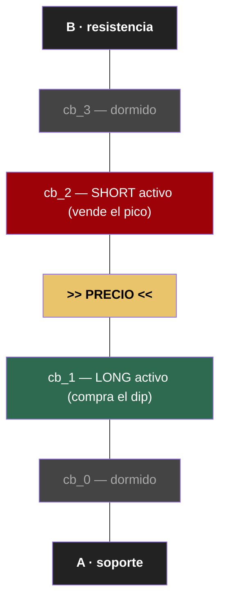
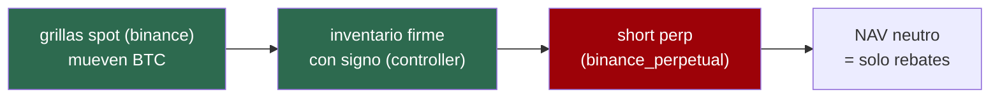

# Grigado — Manifiesto de estrategia

> **Qué es este documento:** la tesis de la estrategia. Qué buscamos, cómo lo
> conseguimos, qué reglas no se rompen, y hacia dónde evoluciona. Consolida el
> manifiesto de portfolio, el modelo del tablero (chessboard) y los pares hedged.
>
> Documentos hermanos:
> - `docs/CONTROLLER.md` — cómo el controller implementa esto (lógica + mermaids).
> - `docs/ROUTINES.md` — las herramientas de diseño (routines de Condor).
> - `docs/GRIGADO_JOURNAL.md` — bitácora de decisiones y estado actual.
>
> **Última actualización:** 2026-06-02

---

## 1. La tesis

Operamos grillas **BTC-BRL en Binance** para **gestionar el ratio de inventario**
del portfolio (cuánto BTC vs BRL tener), explotando que la cuenta tiene **rebate
maker de +0.015%**.

Tres principios que ordenan todo lo demás:

1. **El ratio manda, no el PnL.** El objetivo es mover el %BTC hacia un target
   (ej. 80% → 60%) de forma controlada. El PnL en BRL es subproducto.
2. **Maker o nada.** Toda orden es LIMIT_MAKER. Una ejecución a market pierde el
   rebate y paga fee: rompe el modelo económico.
3. **Capital aislado.** Cada campaña opera sobre una sub-cuenta lógica (base+quote
   asignados), porque otras estrategias comparten el mismo portfolio.

### El objetivo final: NAV neutro cosechando rebates

La evolución del proyecto apunta a un sistema **delta-neutral**: las grillas spot
mueven BTC, y un **short perpetual** (binance_perpetual) cubre ese BTC, de modo que
la única variación del NAV sean los **rebates**. Si el inventario spot y el short
perp se siguen con fidelidad, el portfolio cosecha rebates sin exposición
direccional. Por eso el controller debe ser un "reloj suizo": el hedge se construye
sobre la exactitud de su inventario. Ver §6.

---

## 2. Estrategia viva: el tablero de ajedrez (chessboard)

El rango entre un soporte **A** y una resistencia **B** se divide en **N escalones
contiguos**. Cada escalón tiene un **par LONG + SHORT** que opera esa banda. Solo el
par del escalón que contiene el precio está activo; el resto duerme.

### Los tres estados de una grilla

1. **Operando** — el precio está en su banda; coloca órdenes, cicla, cobra rebates.
2. **Take profit (favorable)** — el precio salió por el lado bueno. Inventario neto
   **cero**, PnL+ de spread. La grilla "ganadora".
3. **Zona muerta + limit (desfavorable)** — el precio cruzó al lado malo. Entre la
   banda y el `limit_price` hay una zona muerta donde no opera; al cruzar el limit,
   cierra **manteniendo el inventario** (`keep_position=true`). Es el **rebalanceo
   logrado** — la grilla "rebalanceadora": no da PnL de spread pero mueve el
   inventario al target y cobra rebates.

### Relevo asimétrico

Cuando una grilla cierra, se activa la consecutiva — y la dirección depende de *por
qué* cerró. Esta es la mecánica central; el detalle con diagramas está en
`docs/CONTROLLER.md §5`.

| Grilla | Cierre favorable (TP) | Cierre desfavorable (limit) |
|--------|----------------------|------------------------------|
| LONG   | releva LONG +1 (arriba) | releva LONG −1 (abajo) |
| SHORT  | releva SHORT −1 (abajo)  | releva SHORT +1 (arriba) |

### Las perillas de calibración

1. **El recorrido techo↔piso** (`techo_pct_btc` / `target_pct_btc`) → define
   **cuánto inventario** se mueve en total. El capital por grilla NO es `total/N/2`
   (eso dimensiona al NAV y sobredimensiona): es la porción del recorrido que le
   toca a cada escalón — `brl_descarga` repartido entre las SHORT arriba del precio,
   `brl_carga` entre las LONG abajo (capital **asimétrico**).
2. **Ancho / N** → la pendiente y la granularidad: rango más angosto = mismo
   movimiento de precio mueve más inventario (más agresivo); N = en cuántos saltos.
3. **Distancia del limit_price** → define la zona muerta y el **centro de masa** del
   rebalanceo (a qué precio promedio queda el inventario movido).

> La primera dice **cuánto** inventario mueve la campaña; la segunda, **a qué
> ritmo**; la tercera, **a qué precio promedio**. El break-even agregado del tablero
> es el promedio de los centros de masa de las grillas que rebalancearon.

### Target local por escalón + histéresis

El corte en target es **local, no global**: cada escalón tiene su %BTC objetivo
(curva lineal techo en A → piso en B). Una SHORT frena si el %BTC ya está en/bajo
el target de SU escalón; una LONG si ya está en/sobre. Así la descarga se
distribuye por el rango y la oscilación del precio en un borde no fuga inventario.
Complemento: **histéresis pegajosa** en el relevo-desde-TAKE_PROFIT (la única
consecutiva que abre posición de golpe al nacer) — no se puebla mientras el precio
esté pegado al borde del escalón. Detalle: `docs/CONTROLLER.md §8`.

### El inventario se mide desde fills (NAV invariante)

El %BTC de la sub-cuenta sale de los fills reales: cada fill mueve base y quote
**1:1 al precio del fill** (BUY +base −quote; SELL −base +quote). El NAV es
invariante al rebalanceo — vender BTC no destruye valor, lo convierte en quote.
Medir el %BTC con el quote fijo encoge el NAV y sobreestima el %BTC (el corte
dispara tarde y el tablero sobre-vende). Detalle: `docs/CONTROLLER.md §6.3`.

### Determinismo del flujo de inventario

Dado un recorrido de precio, **el flujo de inventario es determinístico**: como las
grillas cubren todo `[A, B]` sin huecos, se sabe de antemano qué grillas se cruzan,
en qué orden, y cuánto inventario mueve cada una. Existe una curva `%BTC(P)` exacta
y discreta (escalón por escalón). Eso es lo más valioso del modelo — y lo que hace
posible el hedge cuantitativo.

### Ciclo de vida del tablero

Armado (definir A, B, N, capital) → Operación (relevo dentro del rango) → Salida del
rango (cruzar A o B → cerrar y rearmar tablero) → Llegada al target (corte / fin de
campaña). Un solo tablero activo a la vez.

---

## 3. Drift teórico vs real (metodología)

El modelo determinístico asume grillas perfectamente pobladas y relevo instantáneo.
La realidad introduce **drift** por parámetros operativos del `GridExecutor`:

| Parámetro | Drift que introduce |
|-----------|---------------------|
| `max_orders_per_batch` | la grilla no puebla todos los levels de inmediato |
| `activation_bounds` | levels lejanos no se colocan (liquidez teórica ausente) |
| `order_frequency` | cooldown entre batches; "tren perdido" en movimientos rápidos |
| `max_open_orders` | tope de órdenes simultáneas; menos liquidez real |
| `safe_extra_spread` | reprice a best bid/ask; el precio de fill ≠ nominal → corre el centro de masa |

**Metodología:** modelar el teórico (baseline) → correr grillas reales → medir el
drift por parámetro → decidir cuál usar o relajar. El teórico no es la verdad
operativa; es la regla contra la cual se mide la realidad.

---

## 4. Reglas duras (no contradecir)

| # | Regla |
|---|-------|
| R1 | Toda orden LIMIT_MAKER (open y TP). Verificar en Binance que entren maker. |
| R2 | `keep_position=true` obligatorio (hace que el limit cierre como POSITION_HOLD). |
| R3 | Nunca `stop_loss` en el triple_barrier (cerraría a market, rompe maker). |
| R4 | El corte en target aplica solo a SHORT (descarga). La carga (LONG) sigue. |
| R5 | Capital por grilla > min_notional de Binance (R$ 20). |
| R6 | El %BTC se mide sobre la sub-cuenta asignada, nunca el balance global. |
| R7 | Grillas contiguas sin solapamiento; un solo tablero activo a la vez. |

---

## 5. Estrategia futura: pares hedged (grigado clásico)

Antes del tablero existió el modelo de **pares hedged**: un par = una grilla
**protagonista** (mueve inventario en el sentido del sesgo) + una **cobertura**
(grilla opuesta, rango menor, mitiga el escenario adverso). El dimensionamiento usa
un factor de sesgo `p ∈ [0.5, 0.9]` (default 0.7): `C_protag = C_par × p`,
`C_cobertura = C_par × (1−p)`.

**Relación con el tablero:** el tablero es la **generalización estructurada** del
par. Donde grigado tiene 2 grillas hedgeadas, el tablero tiene N en cadena con
relevo determinístico. El par es más flexible y menos determinístico.

**Estado:** propuesta post-MVP, no implementada. Se evalúa contra el tablero por
benchmark. Documentado acá para no perder la idea; el camino activo es el tablero +
hedge perpetual (§6).

---

## 6. El hedge perpetual — el camino al NAV neutro

El plan que cierra la tesis (§1): un short en **binance_perpetual** que cubre el BTC
spot que las grillas mueven.

**Regla de diseño (decisión tomada):** el short se ajusta **por evento de cierre de
grilla con inventario firme**, NO tick a tick (seguir el inventario instantáneo es
entrópico y falla).

- Grilla cierra por **TAKE_PROFIT** (inventario neutro) → el short **no se toca**.
- Grilla cierra por **POSITION_HOLD** (dejó BTC firme) → el short se ajusta por el
  **ΔBTC firme exacto** de ese cierre. LONG hold = +BTC (agrandar short); SHORT hold
  = −BTC (achicar short).

El short sigue el **BTC spot firme** (`base_assigned + Σ ΔBTC`), no el capital de las
grillas. La fidelidad de ese número es lo que el controller garantiza (ver
`docs/CONTROLLER.md §6-7`).

**Riesgo abierto a validar en datos reales:** que un cierre por TAKE_PROFIT cierre
de verdad con inventario ≈ 0. El executor solo liquida si el residual supera
`min_order_size`; un residual chico quedaría descubierto. El controller lo mide
(`tp_residual_btc`); si no es ≈ 0, el hedge debe cubrir también ese residual.

**Estado:** Fase 1 (inventario firme + conciliación + KPI log) implementada en el
controller. Fase 2 (validación del residual de TP) y Fase 3 (el hedge perp en sí)
pendientes. Roadmap en `docs/GRIGADO_JOURNAL.md §9`.

---

## 7. Glosario rápido

- **Escalón / cb_i**: sub-rango contiguo del tablero donde vive un par LONG+SHORT.
- **Relevo**: activar la grilla consecutiva cuando una cierra.
- **Inventario firme**: BTC que un cierre POSITION_HOLD dejó en el portfolio (con
  signo). Lo que el hedge cubre. Distinto del inventario *en vuelo* (transitorio).
- **Centro de masa**: precio promedio ponderado al que una grilla rebalanceó.
- **Corte en target**: dejar de crear SHORT cuando el %BTC de la sub-cuenta llega
  al objetivo.
- **Drift**: diferencia entre el flujo de inventario teórico y el real.
