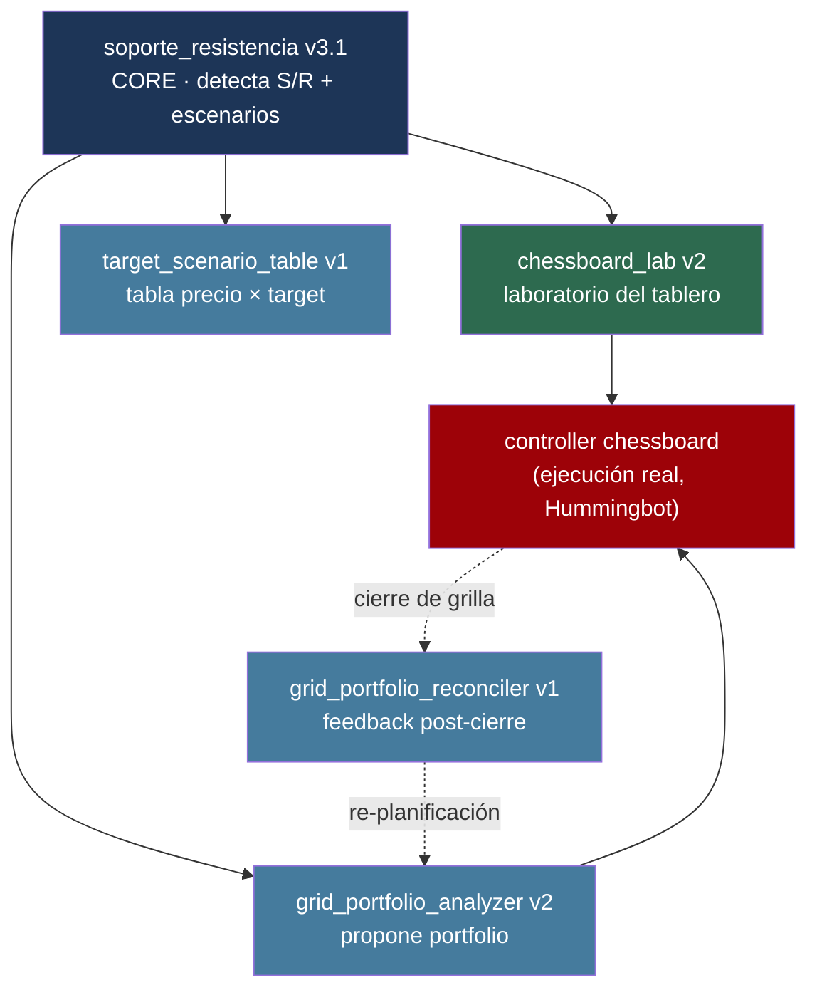

# Grigado — Manual de las routines (Condor)

> **Qué es este documento:** el manual consolidado de las routines de Condor que
> dan soporte a la estrategia. Condor es el agente externo (en
> `/Users/tomasgaudino/PycharmProjects/condor/`) que corre routines de análisis y
> diseño — el **laboratorio** de la estrategia. La **ejecución** real vive en el
> controller de Hummingbot (`docs/CONTROLLER.md`), sin agente externo.
>
> **Última actualización:** 2026-06-10

---

## 1. El framework de routines

Toda routine de Condor sigue la misma estructura técnica:

- **`Config` (pydantic)** + función **`run` asíncrona**. Tipos: *one-shot* (default,
  corre y termina) o *continuous* (loop interno).
- **`context`** da acceso a Telegram y al servidor de Hummingbot vía cliente.
- **Métodos verificados del cliente:** `get_prices`, `get_candles_last_days`,
  `get_state` (balances), `get_history`.
- **Salida:** `ReportBuilder` (HTML en la UI) + notificación corta a Telegram.
  Gráficos con Plotly.
- **Normalización de velas** y manejo de errores robusto son obligatorios.

> Detalle exhaustivo del framework: el manual técnico original de Condor (referencia
> histórica, ahora resumido acá). Las routines vivas se listan abajo.

---

## 2. Mapa de routines y su flujo



Routine **principal viva**: `chessboard_lab`. Routine **núcleo**:
`soporte_resistencia`. Las demás (analyzer, reconciler, target_table) son
herramientas de soporte de distintos grados de madurez.

---

## 3. `chessboard_lab` (v2) — el laboratorio del tablero

**La routine principal.** Simulador determinístico del tablero; **no lanza nada**.

- **Path:** `condor/trading_agents/grigado/routines/chessboard_lab.py`
- **Entrada componible (NAV + %BTC inicial):** `nav_assigned` (NAV total asignado
  en quote; vacío = NAV global de la cuenta) y `pct_btc_inicial` (composición;
  vacío = %BTC global). De ahí deriva `base_assigned`/`quote_assigned` para el
  YAML. La estrategia opera SOLO sobre ese NAV (conviven otras en la cuenta).
  Quote genérico: `base/quote_asset` salen del `trading_pair` (BRL, USDT, FDUSD).
- Obtiene S/R y define el rango `[A, B]` por índices de S/R (`border_a_sr_idx`,
  `border_b_sr_idx`) o valores fijos.
- **Dimensionamiento al recorrido techo↔piso** (`_recorrido_inventario`): el
  capital por grilla NO es `total/N/2` — es la porción del recorrido de inventario
  (`techo_pct_btc` en A → `target_pct_btc` en B) que toca a cada escalón,
  **asimétrico**: `brl_descarga` repartido entre las SHORT arriba del precio,
  `brl_carga` entre las LONG abajo. Matemática idéntica al controller
  (`_recorrido_quote`), verificada con coincidencia exacta.
- **Perfil por niveles objetivo:** `target_levels_per_grid` fija N niveles por
  grilla y DESPEJA el spread (`spread = ancho/(m·precio)`), fiel a la fórmula del
  executor. Alternativa: `spread_per_subrange` crudo.
- **Tabla comparativa (núcleo):** una fila por cantidad de grillas (`min`..`max`):
  niveles, spread efectivo, capital SHORT/LONG (asimétrico), viabilidad de
  `min_notional`. Marca la fila `selected_grid`.
- **Curva de inventario ANCLADA al inventario real:** proyecta desde el precio
  actual (en el precio actual da exactamente tu %BTC real); subiendo descargan las
  SHORT, bajando cargan las LONG, cada grilla cortada por su **target local** (la
  misma curva techo→piso del controller). + candles con niveles, NAV
  estrategia-vs-hold, volumen de rebates.
- **Salida:** bloque copiable "Config resuelta" — YAML **1:1 con
  `ChessboardConfig`** (incluye `techo_pct_btc` y `hysteresis_pct`), pegable
  directo en `conf/controllers/<id>.yml`. `total_amount_quote` va informativo (el
  controller dimensiona por recorrido).

**Pendientes conocidos:**
- Display multi-quote cosmético: `_brl()`/"R$" hardcodeado en gráficos y reporte
  (~44 usos) — los valores son correctos, el formato muestra R$ aunque el quote
  sea USDT.
- `inverse_siding` es un no-op (flag sin efecto).
- Modela el rebalanceo al punto medio del escalón, no al limit_price /
  distribución real de órdenes (reprice maker sin modelar).

---

## 4. `soporte_resistencia` (v3.1) — el núcleo

Detector de soportes y resistencias. **Alimenta a casi todas las demás.**

- Doble pasada de pivots (window=10 estructural, window=3 táctico).
- Clustering ponderado por touches; scoring multifactor (touches, recency con curva
  inverted-U, structural, proximidad).
- Selección top N con **cobertura garantizada de extremos** (máx/mín absoluto si
  score suficiente).
- **v3 agregó** análisis de escenarios de posicionamiento (matriz NAV BRL × USDT por
  `(%BTC, precio_SR)`), con asunciones explícitas (USDT-BRL constante, rebalance sin
  fees, cash rinde 0).
- **v3.1 (patch de ploteo):** muestra TODOS los niveles en el gráfico (sin filtro de
  score), distingue structural (sólida) vs tactical (punteada), evita labels pisados.

**Evolución:** v1 (pierde extremos, ruido) → v2 (clustering + scoring + cobertura de
extremos) → v3 (escenarios + doble NAV) → **v3.1 (fix de visualización)**. Las
versiones previas son histórico.

**Pendientes conocidos:** scoring tiende a aplanarse (revisar pesos); tagging
structural/tactical a veces no discrimina. Sin volumen/POC/VWAP, sin detección de
régimen (futuro v4).

---

## 5. `grid_portfolio_analyzer` (v2) — propuesta de portfolio

Propone un portfolio de grillas como **combinación lineal de aportes esperados**.

- Lee estado (balance, grillas activas, precios), calcula NAV y el delta hacia el
  target. Invoca `soporte_resistencia` en daily e intraday.
- Diseña un vector de aportes (Δfavorable, Δdesfavorable, Δesperado) por grilla, con
  validación de que la suma converge al delta de campaña.
- Valida reglas duras (R1, R3, R5, R7...) contra la propuesta.

**No hace (futuro):** no ejecuta (`create_executor`), no persiste propuestas, no
confirma por Telegram, no auto-calibra por volatilidad. Es propuesta, no ejecución.

---

## 6. `target_scenario_table` (v1) — tabla de decisión de target

Construye una tabla **precio futuro × target %BTC** para decidir a qué % rebalancear.

- Filas: precios futuros (S/R + interpolados + actual). Columnas: targets (10%..100%)
  + una columna "Total" = NAV si NO rebalanceo.
- Cada celda: NAV resultante (en BRL y USDT) si rebalanceo hoy a ese % y el BTC va a
  ese precio. Énfasis visual en filas S/R y celdas con |Δ| grande.

Complementaria a las matrices de escenarios de `soporte_resistencia v3` — ofrece la
vista `(precio × target)` en lugar de `(%BTC × precio)`.

---

## 7. `grid_portfolio_reconciler` (v1 MVP) — feedback post-cierre

Se activa cuando una grilla cierra (event-driven).

- Lee el resultado de la grilla (`close_type`, ΔBTC real, ΔBRL real, ciclos, PnL,
  FER) y el snapshot del portfolio post-cierre.
- Calcula `aporte_real` (Δ%BTC) vs `aporte_esperado` del plan; aplica bandas de
  control (verde ≤3pp, amarilla ≤7pp, roja >7pp) y decide la acción por tabla
  `close_type × banda`.
- Mantiene contador de replans; sugiere abandono si supera el máximo. Dispara el
  Analyzer si corresponde re-planificar.

**No hace (futuro):** scan mode automático (hoy invocación manual por executor_id),
invocación automática del Analyzer, snapshots periódicos, estado en DB.

> **Nota:** el reconciler nació para el modelo de grillas sueltas/pares. Con el
> tablero, parte de su rol (medir el inventario movido por cada cierre) lo cumple
> ahora el propio controller con el inventario firme (`docs/CONTROLLER.md §6`). Su
> futuro depende de cómo evolucione la coexistencia controller-vs-routines.

---

## 8. Validación de sintaxis de una routine

Antes de dar por buena una edición de la routine, validar con el venv de Condor:

```bash
/Users/tomasgaudino/PycharmProjects/condor/.venv/bin/python -c \
  "import ast; ast.parse(open('trading_agents/grigado/routines/chessboard_lab.py').read())"
```

---

## 9. Routines vivas vs históricas

| Routine | Versión viva | Estado |
|---------|--------------|--------|
| `chessboard_lab` | v2 | **principal** |
| `soporte_resistencia` | v3.1 | **núcleo** |
| `grid_portfolio_analyzer` | v2 | soporte |
| `target_scenario_table` | v1 | soporte |
| `grid_portfolio_reconciler` | v1 MVP | soporte (rol en revisión) |

Las versiones previas de cada routine (S/R v1/v2/v3, analyzer v1, etc.) son
histórico superado; su lógica vigente quedó resumida acá.
